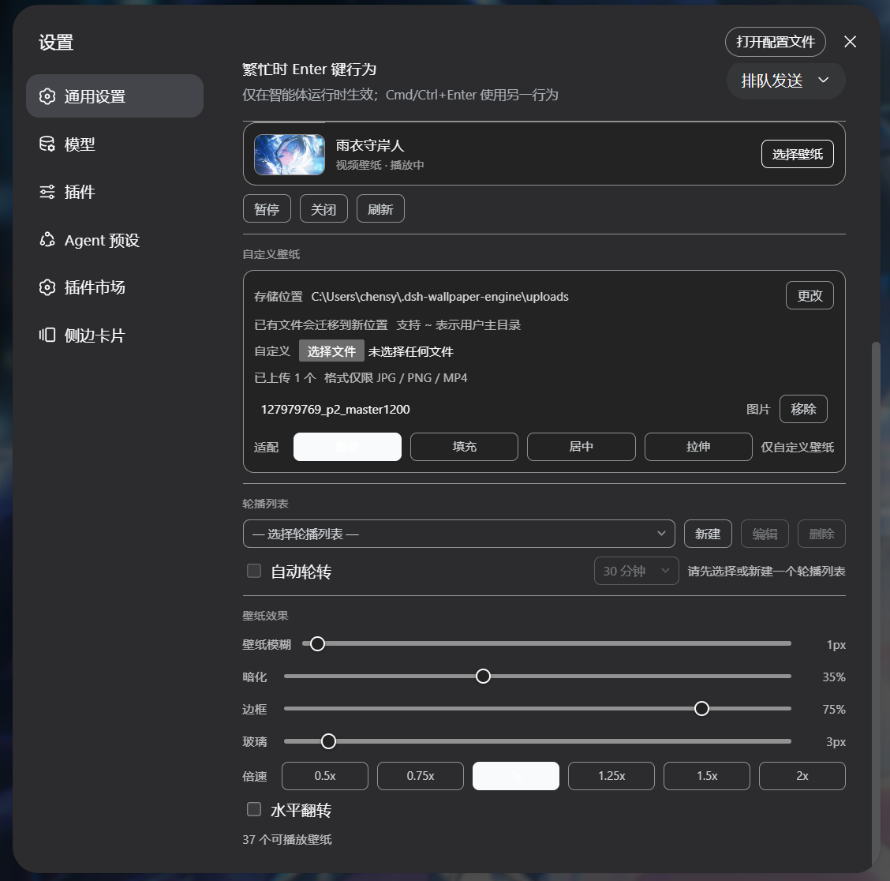
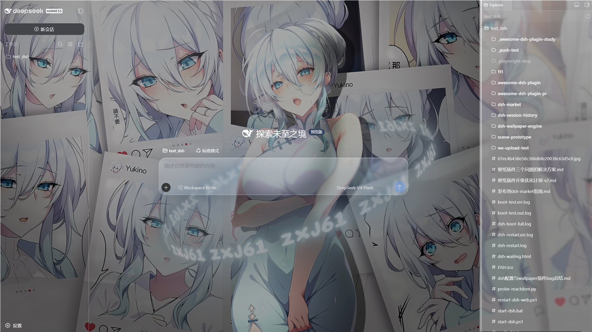

# dsh-plugin-wallpaper-engine

[English](README.en.md) | [中文](README.md)

A DSH bundle that turns your **Wallpaper Engine** wallpapers into the **background of the DSH web GUI** (`dsh web`).

It discovers the Wallpaper Engine install on your machine, lists its wallpapers, and renders them behind the DSH chat interface with an iOS-style **liquid glass** effect: Video (`.mp4`) plays live, Web/HTML loads in an iframe, and **Scene wallpapers appear as extracted static frames**. Since v0.2 it also adds:

- **Modal wallpaper picker** — the thumbnail grid lives in a popup modal, so the settings page stays compact;
- **Hide / restore (soft delete)** — hide wallpapers you don't want, restore them anytime; no source files are touched;
- **Playback speed** — six native presets from 0.5x to 2x, instant, no media reload;
- **Horizontal flip** — mirror the image (video / web / uploaded images);
- **Custom uploads** — use your own local JPG / PNG / MP4 as a wallpaper, with a configurable storage location and fit modes;
- **Scene static frames** (v0.3) — Scene wallpapers extract their main texture as a static background instead of being an unusable "not playable" entry.
- **Liquid-glass settings page** (v0.3.1) — the settings UI is now a **first-level settings page** (following the dsh-web-ui-all skin-center design): the whole page is a customizable liquid-glass card with **accent color** (6 presets + a custom color picker) and **glass transparency** (0–60%). Both apply instantly and persist.
- **Whole-settings-window liquid glass** (v0.3.2) — one click turns the **entire native DSH settings window** (dialog + left nav + ALL native sections: General / Models / Plugins / …) into liquid glass with your custom accent + transparency. With the「设置窗口液态玻璃」master switch on, the window background, nav active/hover, buttons, switches and links all follow the chosen accent and transparency; off restores the stock look.
- **Unified glass tuning** (v0.3.3–v0.3.5) — the settings-window glass blur shares the SAME adjustment as the conversation bar: the **玻璃** (glass) slider (0–60 px) drives the blur radius of both the settings window and the composer/bubbles, with an identical saturation/brightness/contrast recipe. A new **玻璃颜色** (glass color) control lets you tint the glass BASE itself (6 presets + custom picker; defaults white in light / deep navy in dark; once picked, both themes use that color) — **配色** styles the interactive elements, **玻璃颜色** styles the glass itself.


> Wallpaper + scrim + iOS liquid glass rendered behind the DSH GUI.

## Which wallpaper types are supported?

Wallpaper Engine wallpapers come in four types:

| Type | Rendered by | Portable to DSH? |
|---|---|---|
| **Scene** | Wallpaper Engine's own 3D engine | ✅ Static frame — its main texture is extracted (`.pkg`/`.json` .tex or embedded JPEG) |
| **Video** | a plain `.mp4` file | ✅ Yes — plays in a `<video>` tag |
| **Web** | a Chromium (`webwallpaper64.exe`) host for HTML | ✅ Yes — loads in an `<iframe>` |
| **Application** | an injected external window | ❌ No |

A Scene wallpaper's 3D scene (shaders/particles/geometry) cannot be replayed in a
browser, but its **main texture** (usually the background artwork) can be
extracted as a **static frame** — for photographic and illustration-style scenes
the result is close to the original image. Scene cards carry a「静态帧」badge in
the picker.

> **Expected coverage**: **most Scene wallpapers produce a good static frame**
> (measured ~80%+ on a real library — especially photographic, illustration and
> animation-screenshot scenes); **a small portion cannot display properly**:
> pure shader/particle/procedural scenes (no extractable main texture), scenes
> using exotic texture formats (e.g. BC7), and video-texture-driven animated
> scenes. Those automatically fall back to the workshop preview image
> (`preview.jpg`) — expected behaviour, not a defect.

### Scene static frames: how it works

- **Reading**: parses `scene.pkg` (PKGV container + LZ4 entry chains) or a loose
  `scene.json` directory, locates the main texture starting from the first
  `image` object in `scene.json` (material / instance texture references), with
  all remaining `.tex` files ranked by an art-likelihood score (embedded
  JPEG/PNG payloads score highest; mask/effect/depth/workshop helpers are
  penalized, R8/RG88 grayscale formats nearly excluded).
- **Decoding**: TEX containers (TEXV0005/TEXI0001, TEXB0001-4 mipmaps, LZ4 or
  raw) decode to a static image — **RGBA8888 / R8 / RG88 / DXT1 / DXT3 / DXT5**
  plus **WE embedded JPEG / PNG textures** (common for photographic scenes;
  passed through untouched, zero decode, best fidelity).
- **Quality gate**: decoded frames are sampled — grayscale (>88% gray) or flat
  (near-zero variance) frames are rejected and the next candidate is tried;
  when nothing passes the extractor falls back to the project `preview.jpg`,
  so gray masks/depth maps/solid fills never masquerade as the wallpaper.
- **Video-texture detection**: WE animation-sync textures (embedded MP4, e.g.
  `*_sync`) cannot produce a static frame; they are detected and fall back to
  the preview instead of emitting garbage pixels.
- **Cache**: results are cached at `~/.dsh-wallpaper-engine/cache/frames/`
  keyed by `<version>_<path>_<mtime>` (override with `DSH_WE_CACHE_DIR`);
  workshop updates and extractor upgrades invalidate the frame automatically.
- **Limits**: BC7 / RGB565 / 16-bit-float textures cannot be decoded (falls
  back to the project `preview.jpg`); a static frame is not a 3D render —
  animated particles/water ripples won't appear.

## How it works

- **Host half** (`lib/index.js`): a Cordis plugin that
  1. locates the Wallpaper Engine install by reading Steam's `libraryfolders.vdf`
     (so it works even when Steam is on a non-default drive),
  2. enumerates wallpapers from `projects/defaultprojects`, `projects/myprojects`,
     and `steamapps/workshop/content/431960/*`,
  3. registers same-origin HTTP routes on the DSH webserver so the browser half
     can fetch data and stream media directly:
     - `GET /wallpaper-engine/inventory` → JSON list of wallpapers
     - `GET /wallpaper-engine/media/<token>` → video / HTML (Range supported)
     - `GET /wallpaper-engine/preview/<token>` → preview image
     - `GET /wallpaper-engine/scene-frame/<token>` → scene static frame (main texture, JPEG passthrough or PNG, disk-cached)
     - `POST /wallpaper-engine/upload` → upload a custom wallpaper (JPG / PNG / MP4, raw bytes)
     - `POST /wallpaper-engine/remove` → remove an uploaded wallpaper
     - `POST /wallpaper-engine/upload-dir` → change the upload directory (persisted to `~/.dsh-wallpaper-engine/config.json`, migrates existing files)
- **Client half** (`lib/client.js`): a browser module that fetches the inventory
  and renders the selected wallpaper into a fixed layer *behind* the app columns,
  plus a **first-level settings page** "Wallpaper Engine" (liquid-glass card,
  picker modal, hide/restore, playback speed / flip, accent color + glass
  transparency, and custom-upload management).
- **Custom-upload storage**: uploaded files are written to a plugin-managed local
  directory (default `~/.dsh-wallpaper-engine/uploads`, changeable from the
  settings UI) and served through the same `/media` + `/preview` routes as WE
  media — identical pipeline, survives restarts, no browser quota limits.

## Install

### For users (published version, recommended)

If you simply want to use the plugin, install the published package from npm:

```sh
dsh plugin --profile web add dsh-plugin-wallpaper-engine
```

Then restart `dsh web` and open **Settings → Wallpaper Engine**.

> **macOS users**: Wallpaper Engine has no macOS client. The macOS line of this
> plugin (WaifuX + loose-media support) is maintained by Jerry and published as
> a separate npm package:
>
> ```sh
> dsh plugin --profile web add dsh-plugin-wallpaper-engine-mac
> ```
>
> Repo: https://github.com/ruijiaang-lab/dsh-wallpaper-engine

### For developers (running your own copy)

**For most people you can skip this section.** You only need it if you want to
work on the plugin's code yourself. The steps below assume you know what a command
line and a *repository* (a code folder that is under Git version control) are.

**1. Get the code (`checkout`)**

> *What "checkout" means:* it just means "download/get a copy of the source code
> into a folder on your machine." Typically you click **Code → Download ZIP** on
> this GitHub page and unzip it, or clone it with Git:
>
> ```sh
> git clone https://github.com/elysia395/dsh-wallpaper-engine.git
> ```
>
> After this you have a folder that contains `package.json`, `lib/`, `src/`, and
> `cordis.patch.yml`. That folder is what the rest of this section calls
> **the plugin folder**.

**2. Install it using its folder path (`link:`)**

> *What `link:` means here:* it tells `dsh` (which forwards the command to `pnpm`)
> to make a *link* to your local plugin folder instead of downloading a package
> from the internet. The benefit: when you edit the code and rebuild, the change
> shows up without reinstalling.

Replace `<插件文件夹绝对路径>` below with the **full path of your plugin folder**
(the "address bar" path you see when you open that folder in Explorer / your file
manager):

```sh
dsh plugin --profile web add link:<插件文件夹绝对路径>
```

**Concrete example** — if your plugin folder is at a path like `D:\dev\dsh-wallpaper-engine`:

```sh
dsh plugin --profile web add link:D:\dev\dsh-wallpaper-engine
```

You can also use a relative path if your shell's current directory is already the
folder's parent:

```sh
dsh plugin --profile web add link:./dsh-wallpaper-engine
```

> **Which exact path to fill in?** It must be the **folder that contains
> `package.json`** — not the path to `package.json` itself, and not any file inside.
> It is the same value you would paste into Explorer's address bar to open that folder.

> Why prefer `link:` over `file:`? `link:` creates a live link to your source
> folder, so edits to `src/client.js` + `npm run build` take effect without
> reinstalling; `file:` packs a static snapshot, which needs a re-add after every
> change. Both work for a first install.

Then restart `dsh web`. The host plugin becomes a bundle layer and the client
plugin auto-loads (`dsh.client.immediately: true`).

If your machine has Steam installed in a non-standard location, the host auto-detects
via `libraryfolders.vdf`. Nothing further is required.

## Usage

1. Open `dsh web` → the DSH GUI.
2. Open **Settings** and pick **Wallpaper Engine** from the left navigation (a first-level settings page, its own nav entry).
3. Click **选择壁纸** to open the picker modal, then click a Video/Web wallpaper (or an uploaded image/video) in the thumbnail grid. It appears behind the app; close the modal via the backdrop, ESC, or the close button. Scene/Application wallpapers cannot be embedded in the web UI and are hidden from the grid.
4. Use **暂停/播放** to pause a video wallpaper, and **关闭** to clear it.
   The choice is remembered in your browser's `localStorage` (key
   `dsh-wallpaper-engine:selection`).



> The settings page: the liquid-glass card (外观 accent/transparency), the current-wallpaper card, plus the 自定义壁纸 / 轮播列表 / 壁纸效果 sections.


> The picker modal: browse every wallpaper thumbnail, batch-hide, and restore from the hidden tab.

### Hide & restore (soft delete)

Every wallpaper card has a **隐藏** button in its top-right corner — it only removes the wallpaper from the list, **never touches the source file**. Restore any wallpaper from the **已隐藏** tab in the modal (single restore or **全部恢复**); the **批量** button in the modal toolbar enters multi-select mode to hide several at once. Hidden state is persisted in `localStorage` (survives refresh/restart); hiding the currently playing wallpaper doesn't interrupt playback, and automatic rotation skips hidden wallpapers.

### Content-rating & type filters

Above the thumbnail grid in the picker modal there are two dropdowns that
reproduce Wallpaper Engine's own categorisation:

- **内容分级** (content rating) — reads each wallpaper's `contentrating` field
  from `project.json` (WE's workshop tags G / PG13 / R): **全部** (all) /
  **Everyone (G, default)** / **PG13** (parental guidance) / **Mature (R)** /
  **未分级** (unrated — wallpapers without the field, typically local projects
  or custom uploads).
- **类型** (type) — filters by the embeddable type: **全部** (all) / **视频**
  (video) / **网页** (web) / **图片** (image, custom uploads).

Every option shows how many playable wallpapers currently match. Wallpapers
outside the selected categories are dropped from the grid, the rotation editor
and the rotation candidates — they are never auto-selected or rotated either.
The choice persists in browser `localStorage`; the default is **Everyone**,
mirroring Wallpaper Engine's conservative first-run stance.

> Note: the rating is read from each wallpaper file's `contentrating` field —
> the same rating WE's client shows — but the plugin does **not** follow the
> adult-content switch inside the Wallpaper Engine client (it scans the disk
> directly and bypasses WE's configuration).

### Card style & vinyl record

- **紧凑布局 (compact layout)**: a sliding toggle at the top of the settings
  page. ON gives the **CD-rack** look — cards stack like CD jewel cases
  (each row's top covers the row above, vertical only), hovering scales the
  card up and brings it to the front, the grid is tighter (~7 cards per row)
  and shows everything on ONE page with no pagination. OFF is the regular
  grid (fixed-height overlap-proof cards with pagination, default). The
  choice persists in `localStorage`.
- **黑胶唱片 (vinyl record)**: next to the wallpaper selection there is a
  **rotating vinyl record** that uses the selected wallpaper's cover as the
  record label — it spins while the wallpaper plays and stops when paused
  (animation is disabled under `prefers-reduced-motion`). A small record also
  sits in the picker modal head. The vinyl shows in **both** card styles.

### Playback speed & horizontal flip

With a video wallpaper selected, the **壁纸效果** area shows the **倍速** presets (0.5x / 0.75x / 1x / 1.25x / 1.5x / 2x) — driven by the browser's native `playbackRate`, instant, no reload or black flash (wallpaper videos are muted, so there is no audio to keep in sync). The **水平翻转** toggle mirrors the image via CSS `scaleX(-1)` — it works for video, web, and uploaded images/videos alike, with zero main-thread cost.

### Custom wallpapers

The **自定义壁纸** section uploads local images (JPG / PNG) or videos (MP4) as wallpapers:

- **Storage location**: files default to `~/.dsh-wallpaper-engine/uploads` (your home directory — usually the C: drive). Click **更改** to move storage to any drive (absolute path, `~` supported); existing files migrate automatically and the choice persists across restarts — recommended for users who don't want wallpaper data on the system drive.
- **Format limit**: JPG / PNG / MP4 only; validated twice (browser + host) with a clear error message.
- **Fit modes**: 覆盖 (cover) / 填充 (contain) / 居中 (center) / 拉伸 (fill) — applied to custom wallpapers only (WE wallpapers keep their intended cover framing).
- **Management**: each upload can be **移除** (confirm dialog, deletes the local file); uploaded wallpapers also support hide/restore, playback speed, and flip.
- **Deduplication**: re-uploading an identical file is detected by content (SHA-256) and returns the existing entry — no duplicate copies pile up in the library.

### Automatic rotation (轮播列表)

Rotation runs over **user-defined carousel lists** (轮播列表). Create any number of lists with **新建**, pick Video/Web wallpapers into each from the inventory, give each list its own switch interval (1, 5, 10, 30, 60 or 120 minutes) and order (顺序/随机), then enable **自动轮转** on the list you want active. Lists are persisted in your browser's `localStorage` and are fully client-side — rotation never depends on Wallpaper Engine's own `config.json` playlist paths.

At least two playable Video/Web wallpapers per list are required; manual changes reset the next timer; each list keeps its own cadence, so you can have one list switching every 5 minutes and another every 30. On first run, the first playable Wallpaper Engine playlist is imported automatically as a list so the feature works out of the box; **从 WE 播放列表导入** inside the editor imports any other playlist into the list being edited. Scene and Application wallpapers cannot be embedded in the web UI, so they are automatically excluded from rotation and hidden from the picker.

### Liquid-glass appearance (whole settings window + accent + transparency)

The **外观** (appearance) area at the top of the settings page controls the look
of the **entire native DSH settings window** (following the dsh-web-ui-all
skin-center design):

| Control | What it controls | Range | Default |
|---|---|---|---|
| **设置窗口液态玻璃** (settings-window glass) | Master switch: turns the whole settings window (dialog + left nav + all native sections) into liquid glass | on / off | on |
| **配色** (accent) | Theme color: buttons, switches, links, nav active, sliders and glass highlights inside the window all follow it | 6 presets + custom color picker | `#4f8cff` classic blue |
| **玻璃颜色** (glass color) | The BASE TINT of the settings-window glass itself (not just transparency) | 6 presets + custom color picker | white (light) / deep navy (dark) |
| **玻璃透明度** (glass transparency) | Opacity of the glass surfaces (settings window, composer, bubbles, sidebar panels) | 0–60 % | 12 % |

> With the master switch on, **every native section** (General / Models /
> Plugins / …) and the left nav become one liquid-glass + accent look — the
> plugin overrides the shell tokens scoped to the settings dialog, so nothing
> outside the window is touched. The settings-window glass blur uses the SAME
> adjustment range as the conversation bar: the **玻璃** (glass) slider (0–60 px)
> drives the blur radius of both the settings window and the composer/bubbles,
> with an identical saturation/brightness/contrast recipe; **玻璃颜色** sets the
> base tint of the glass itself (defaults white in light / deep navy in dark;
> once picked, both themes use that color), and the **玻璃透明度** control sets
> the transparency — higher lets the wallpaper colour show through more clearly,
> lower approaches solid. Browsers without `backdrop-filter` automatically fall
> back to a high-opacity solid so text stays readable. All controls apply
> instantly and persist in `localStorage`.

### The four sliders

While a wallpaper is active, four sliders let you tune how it blends with the UI:

| Slider | What it controls | Range | Default |
|---|---|---|---|
| **壁纸模糊** (wallpaper blur) | Blurs the wallpaper itself | 0–60 px | 0 |
| **暗化** (scrim) | Darkens the overlay between wallpaper and text | 0–90 % | 25 % |
| **边框** (border) | Raises border/divider contrast | 0–90 % | 35 % |
| **玻璃** (glass) | Blur radius of the frosted-glass panels (composer, bubbles) | 0–60 px | 24 |

> **Light vs. dark mode** — Wallpapers differ wildly in colour and brightness, so
> there is no one mode that fits every wallpaper. Switch DSH's theme between
> **light** and **dark** to find which suits the current wallpaper. If text or
> hairlines become hard to read on a bright or busy wallpaper, raise the
> **暗化 / 边框** sliders (and optionally add a little **壁纸模糊**) until it is
> comfortable. All four sliders apply instantly — no page refresh needed.

## Configuration

There is no model-visible tool or prompt text. The bundle adds zero tokens to the
agent. Selection, hidden state, and rotation lists live in browser `localStorage`;
no durable DSH settings are written. The only on-disk data is the **custom-upload
files** (in the directory you chose) and `~/.dsh-wallpaper-engine/config.json`
(~100 bytes) that remembers that directory.

## dsh-better-sidebar compatibility

The liquid-glass effect is specifically adapted for dsh-better-sidebar's panels
(frost, specular highlight, and layer hierarchy are unified), so the sidebar and
the conversation area share the same wallpaper + scrim background and read as one
continuous surface.



## Limitations

- Scene (native 3D) and Application wallpapers cannot be embedded; they are hidden
  from the thumbnail picker and rotation candidates. Their live render remains
  Wallpaper Engine's desktop job.
- The browser must be able to autoplay muted `<video>` (DSH runs on loopback; muted
  autoplay is allowed by modern browsers).
- Media is served from your local Wallpaper Engine install paths; the host only
  serves files it has already enumerated (no arbitrary filesystem exposure).
  Custom uploads likewise stay on your machine — nothing is uploaded to any server.
- The picker is English/Chinese mixed (this bundle is not yet wired into DSH's
  locale namespaces).

## Development / rebuild

The host half (`lib/index.js`) is plain ESM with no build step. The client half
(`lib/client.js`) is a **compiled artifact** produced from the canonical source
`src/client.js` by `scripts/build-client.mjs`, which emits the exact
`window.__ModuleLoader__.load({ id, factory })` envelope the DSH module loader
consumes (the same shape `tsdown` emits for in-box client packages).

```sh
npm run build      # regenerate lib/client.js from src/client.js
npm run verify     # materialize the emitted bundle and assert its exports
```

Edit `src/client.js`, then `npm run build`. Do not hand-edit `lib/client.js`.
`npm install`/`pnpm install` runs `prepare` → `build` automatically, so a
fresh checkout always ships a current `lib/client.js`.

The host↔browser contract is plain same-origin HTTP, so the two halves are
developed independently: rebuild the host by restarting `dsh web`, and rebuild
the client with `npm run build` before re-running `dsh web`.

